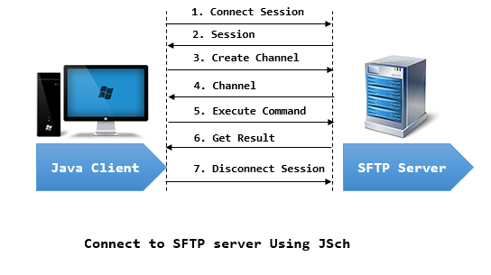

# 목표
* jsch를 이용하여 ssh client 구현

 

# jsch 동작 흐름

  jsch 흐름

 

# 참고자료
* [1] 스택오버플로우-input, error 메세지 수신: https://stackoverflow.com/questions/6902386/how-to-read-jsch-command-output
* [2] 블로그-jsch ssh connection: https://kmongcom.wordpress.com/2014/03/18/jsch-%EB%9D%BC%EC%9D%B4%EB%B8%8C%EB%9F%AC%EB%A6%AC%EB%A5%BC-%EC%82%AC%EC%9A%A9%ED%95%B4%EC%84%9C-sftp-ssh-%ED%81%B4%EB%9D%BC%EC%9D%B4%EC%96%B8%ED%8A%B8-%EA%B5%AC%ED%98%84%ED%95%98%EA%B8%B0/
* [3] 이미지 출처: https://hsalearn.blogspot.com/2017/10/jsch-java-secure-channel.html