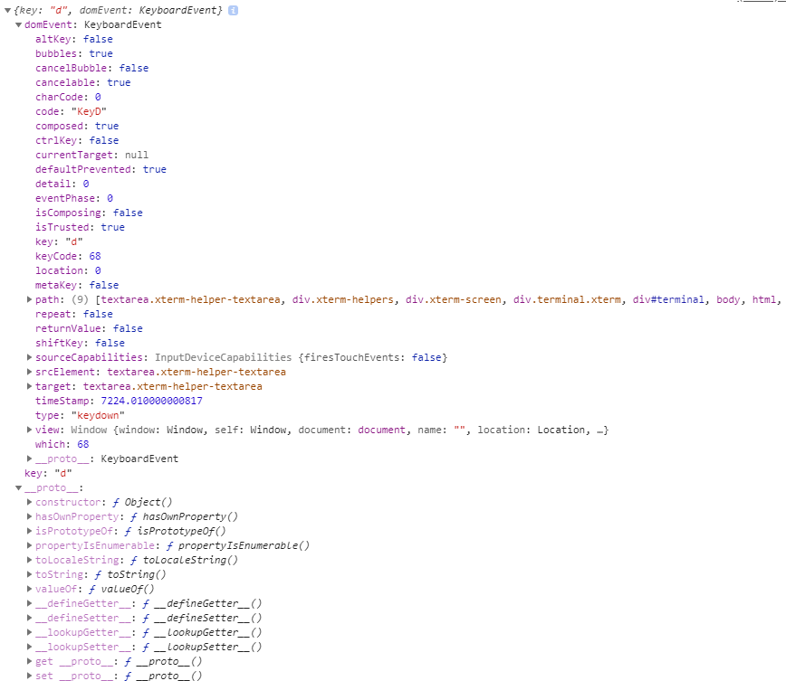

# 1. 터미널 생성
```javascript
var term = new Terminal();
```

<br>

# 2. 문자열 출력
* write: 문자열 출력
* writeln: 문자열 출력 후 개행(엔터)
```javascript
var term = new Terminal();
term.write("hello world");
term.writeln("hello world");
```

<br>

# 3. 키보드 입력 이벤트
* 입력한 키: domEvent.key
```javascript
var term = new Terminal();
term.write("hello world");
term.writeln("hello world");
term.onKey(function (key){
    var printable = (!key.altKey && !key.altGraphKey && !key.ctrlKey && !key.metaKey);
    console.log(key);
});
```



<br>

# 기타
* 사용자가 엔터를 입력하면 term.prompt함수가 호출
  * term.prompt안에 입력한 커맨드가 존재

# 참고자료
* [1] xtermjs 공식문서: https://xtermjs.org/docs/api/terminal/classes/terminal/
* [2] live - xtermjs demo: https://codesandbox.io/s/yv21krq4x?file=/index.js
* [3] 블로그 - xtermjs for beginner: https://medium.com/codingtown/xterm-js-terminal-2b19ccd2a52
* [4] 블로그-javascript keycode: https://www.hahwul.com/2015/09/23/coding-html-javascript-input-html-key/